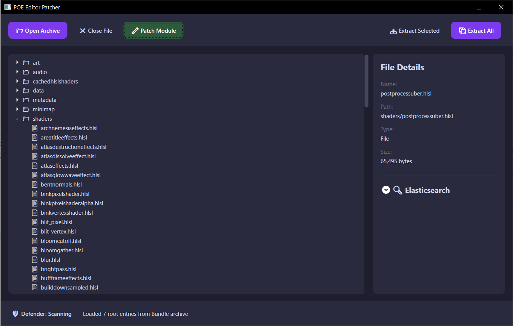
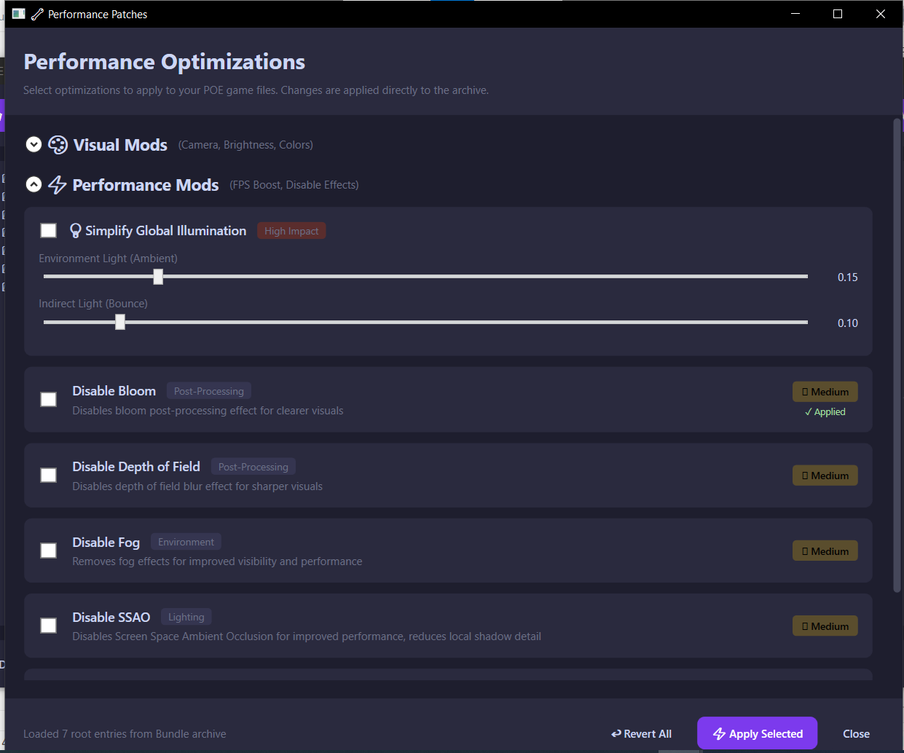
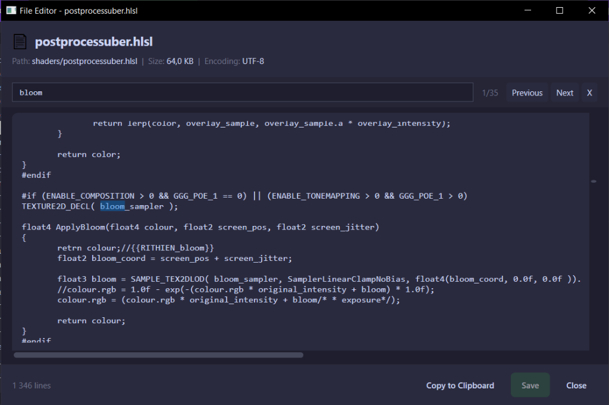

# POE Editor Patcher smoother

Desktop application designed to optimize Path of Exile performance and visual clarity. By patching game shaders and configuration files directly, it enables significant FPS boosts, removes visual clutter (fog, bloom, particles), and customizes the game's rendering pipeline for a smoother, more responsive experience—perfect for both low-end machines and high-performance setups seeking a competitive edge.

> ⚠️ **Note:** Beta version!

## Screenshots

<p align="center">
  
  <br>
  <i>Main application window with file browser and details</i>
</p>

<p align="center">
  
  <br>
  <i>Performance optimization settings</i>
</p>

<p align="center">
  
  <br>
  <i>Built-in file editor with syntax highlighting</i>
</p>

## Features

### ✅ Phase 1: File Extraction (Done)

- [x] Open Content.ggpk (Standalone version)
- [x] Open \_.index.bin (Steam/Epic version)
- [x] Auto-detect installation folder
- [x] Browse virtual file system
- [x] Extract individual files
- [x] Extract entire directories
- [x] Extract all files with progress
- [x] Index files to Elasticsearch
- [x] Marker-based patch detection (idempotent patching)
- [x] Persistent backups with First Touch strategy
- [x] External JSON patcher configs (no recompilation needed)
- [x] Grouped patches UI (Visual Mods / Performance Mods)
- [x] Close File button to release archive
- [x] **File Preview & Edit** - double-click to view/edit file contents in modal window

### 🚧 Phase 2: Performance Optimizations (Current)

Based on analysis of ~333,000 indexed game files:

| Optimization       | Impact    | Target Files                               | Status  |
| ------------------ | --------- | ------------------------------------------ | ------- |
| Disable Bloom      | High      | `postprocessuber.hlsl` (ApplyBloom)        | ✅ Done |
| Disable DoF        | Medium    | `postprocessuber.hlsl` (ApplyDoF)          | ✅ Done |
| Simplify GI        | Very High | `globalillumination.hlsl` - early return   | ✅ Done |
| Fog Removal        | Medium    | `fog.ffx`, `postprocessuber.hlsl`          | ✅ Done |
| Camera Zoom        | Visual    | `.ot`/`.otc` files (CreateCameraZoomNode)  | ✅ Done |
| Brightness Boost   | Visual    | `postprocessuber.hlsl` (Colour Multiplier) | ✅ Done |
| SDR Scale Boost    | Visual    | `oetf.hlsl` (OutputSDR multiplier)         | ✅ Done |
| Gamma Adjustment   | Visual    | `oetf.hlsl` (OETF gamma curve)             | ✅ Done |
| Disable SSAO       | High      | `screenspaceambientocclusion.hlsl`         | ✅ Done |
| SS Shadows         | High      | `screenspaceshadows.hlsl`                  | ✅ Done |
| Map Reveal         | Visual    | `minimap_blending_pixel.hlsl`              | ✅ Done |
| Disable Vignette   | Low       | `postprocessuber.hlsl` (ApplyVignette)     | ✅ Done |
| Env Particles      | High      | `metadata/terrain/*{fog,mist,dust}.aoc`    | ✅ Done |
| Volumetric FX      | Medium    | `volumetricfx.hlsl`                        | Planned |
| SS Rays            | Medium    | `screenspacerays.hlsl`                     | Planned |
| Torch Flames       | Medium    | `metadata/terrain/*torch*.aoc`             | Planned |
| Simplify Spells    | Medium    | `metadata/effects/spells/*.aoc`            | Planned |
| Monster Effects    | High      | `metadata/effects/spells/monsters_effects` | Planned |
| Decorative Blood   | Low       | `metadata/terrain/*blood*.aoc`             | Planned |
| Simplify Materials | Medium    | 136,006 `.mat` files                       | Planned |

### Files Modified by Patchers

| Patcher          | Files                                                                          |
| ---------------- | ------------------------------------------------------------------------------ |
| Disable Bloom    | `shaders/postprocessuber.hlsl`                                                 |
| Disable DoF      | `shaders/postprocessuber.hlsl`                                                 |
| Simplify GI      | `shaders/globalillumination.hlsl`                                              |
| Fog Removal      | `shaders/fog.ffx`, `shaders/postprocessuber.hlsl`                              |
| Camera Zoom      | `metadata/characters/character.ot`, `.ot`/`.otc` files                         |
| Brightness Boost | `shaders/postprocessuber.hlsl`                                                 |
| SDR Scale Boost  | `shaders/include/oetf.hlsl`                                                    |
| Gamma Adjustment | `shaders/include/oetf.hlsl`                                                    |
| Disable SSAO     | `shaders/screenspaceambientocclusion.hlsl`                                     |
| SS Shadows       | `shaders/screenspaceshadows.hlsl`                                              |
| Map Reveal       | `shaders/minimap_blending_pixel.hlsl`, `shaders/minimap_visibility_pixel.hlsl` |
| Disable Vignette | `shaders/postprocessuber.hlsl`                                                 |
| Env Particles    | `metadata/terrain/**/*{fog,mist,dust,glowworm}*.aoc` (~62 files)               |

## Requirements

- Windows 10/11
- .NET 9.0 Runtime
- Path of Exile installed (Steam or Standalone)

## Usage

1. Click **Open Archive** to select `Content.ggpk` or `_.index.bin`
2. Or click **Open Folder** to select PoE installation directory
3. Browse the file tree on the left
4. Select files/folders and click **Extract Selected**
5. Or click **Extract All** to extract everything

## Technology Stack

- **.NET 9.0** - Runtime
- **WPF** - User Interface
- **LibGGPK3** - GGPK/Bundle file handling
- **CommunityToolkit.Mvvm** - MVVM pattern

## Building

```bash
git clone https://github.com/rithien/poe-editor-patcher.git
cd poe-editor-patcher
dotnet build
dotnet run --project src/PoeEditor.UI
```

## Project Structure

```
poe-editor-patcher/
├── src/
│   ├── PoeEditor.Core/           # Core library (extraction, patching)
│   │   ├── Patchers/             # Patcher implementations (Brightness, Gamma, Fog, etc.)
│   │   ├── Models/               # Data models
│   │   └── Services/             # Business logic (Backup, FileSystem)
│   │
│   └── PoeEditor.UI/             # WPF Application
│       ├── ViewModels/           # MVVM ViewModels
│       ├── Converters/           # WPF Value Converters
│       ├── Views/                # XAML Views
│       └── patchers/             # External JSON configurations
│
└── libs/                         # Native dependencies
```

## Repatch Logic Flow

```
Apply Patch clicked
       │
       ▼
┌──────────────────┐
│ Check IsApplied  │
└────────┬─────────┘
         │
    ┌────┴────┐
    │         │
   YES       NO
    │         │
    ▼         ▼
┌────────┐  ┌─────────────┐
│repatch?│  │ Normal flow │
└───┬────┘  │  (backup +  │
    │       │   patch)    │
  ┌─┴─┐     └─────────────┘
  │   │
FALSE TRUE
  │   │
  ▼   ▼
┌────────────┐  ┌─────────────┐
│ Return     │  │ Execute     │
│ Success(0) │  │ repatch     │
│ "Already   │  │ with new    │
│  applied"  │  │ values      │
└────────────┘  └─────────────┘
```

## Changelog

### v0.1.15 (2026-01-26)

- **FIX: Restore All not saving changes to disk**
  - Problem: `RestoreAllAsync()` restored files only in memory (RAM) but did NOT call `index.Save()`. After closing/reopening the archive, files remained patched while backups were already deleted (resulting in "Dirty" state).
  - Solution: Added 3-phase logic:
    1. Phase 1: Restore all files to memory
    2. Phase 2: Save changes to disk (`index.Save()`) BEFORE removing backups
    3. Phase 3: Remove backups only after successful save
  - This ensures backups remain available if save fails

### v0.1.14 (2026-01-26)

- **FIX: ArgumentOutOfRangeException when all patchers selected**
  - Problem: Error `offset ('398649') must be less than or equal to '186898'` occurred only when all patchers were selected
  - Cause: Multiple patchers modify the same file `postprocessuber.hlsl` (Bloom, DoF, Brightness, Vignette). After each patcher, `index.Save()` was called, which rewrote the bundle and invalidated offsets in `FileRecord`. Next patcher used stale offsets → crash.
  - Solution: Removed intermediate `Save()` calls between patchers. Now `Save()` is called only once at the end after all patchers complete.

### v0.1.13 (2026-01-26)

- **NEW: Select All checkboxes** - Quick enable/disable all patches in each section
  - "Select All (Max)" in Visual Mods header - enables all visual patches with maximum values:
    - Camera Zoom x3 (max zoom out)
    - Brightness x1.75 (+75%)
    - SDR Scale x1.75 (+75%)
    - Gamma 1.6 (very bright)
    - Map Reveal enabled
    - Vignette disabled
  - "Select All" in Performance Mods header - enables all performance patches:
    - GI with max brightness values (1.0, 1.0)
    - All other performance patchers enabled
  - "Select All" in Particle Mods header - enables all particle patches
  - Unchecking deselects all patches in that section
- **FIX: UI Layout**
  - Fixed alignment of "Select All" checkboxes in headers to ensure consistent positioning regardless of label text length

### v0.1.11 (2026-01-25)

- **FIX: File Editor encoding detection**
  - Fixed FFX files with UTF-16 LE BOM showing "��" at the beginning
  - Added proper BOM detection (UTF-16 LE, UTF-16 BE, UTF-8) before falling back to extension-based detection
  - Added null-byte heuristic for UTF-16 files without BOM
  - Files are now saved with their detected encoding (not assumed from extension)

### v0.1.9 (2026-01-25)

- **FIX: Repatch logic for one-time patchers**
  - One-time patches (bloom, fog, vignette, etc.) now correctly return "Applied" on re-apply
  - Previously returned "FAILED" because original pattern was no longer in file
  - Added `repatch` flag to JSON configs: `false` = one-time, `true` = supports value changes
  - Dynamic patchers (brightness, camerazoom, gamma, sdrscale) marked with `repatch: true`

### v0.1.8 (2026-01-25)

- **REFACTOR: Simplified Backup System** - Complete rewrite of backup service
  - Removed hash-based folder/file naming - now uses human-readable folder structure
  - Removed manifest.json - folder structure IS the manifest
  - Removed per-patcher tracking - backup contains ORIGINAL file regardless of which patcher touched it first
  - Added auto-cleanup of stale backups when clean game files detected (e.g., after Steam verify)
  - Added `RestoreAllAsync()` method to restore all files at once
  - Significantly reduced code complexity (~100 lines vs ~300)
  - Backup location: `%APPDATA%/PoeEditorPatcher/backups/` with preserved folder structure

### v0.1.7 (2026-01-25)

- **NEW: File Editor Window** - Double-click files in tree to view and edit contents
  - Supports text files: `.hlsl`, `.inc`, `.ffx`, `.ot`, `.it`, `.ao`, `.otc`, `.itc`, `.aoc`, `.txt`, `.mat`, `.mtp`, `.sm`, `.amd`, `.json`
  - Automatic encoding detection (UTF-8 for shaders, UTF-16 LE for game configs)
  - Direct save to archive - edits are written immediately to game files
  - Dirty state tracking with unsaved changes warning
  - Copy to clipboard functionality
  - **Search functionality** (Ctrl+F, F3/Shift+F3 for next/previous)
- **UI: Dark Theme Improvements**
  - Dark scrollbars matching the theme (purple accent on drag)
  - Dark title bar on Windows 10/11 for all windows

### v0.1.6 (2026-01-24)

- **FIX: GammaPatcher** - Fixed targeting wrong pattern (commented line instead of actual gamma variable)
  - Now correctly targets `float m = 1.0f / 2.4f;` in OETF_REC709 function
  - Previous version was trying to patch a commented-out line (`//return pow(saturate(linCol), 1.0f / 2.2f);`)
  - Gamma patcher now works correctly with sRGB standard gamma (2.4 default)
- **CHANGE: Brightness Boost values** - Updated from 1.15/1.25/1.50 to 1.25/1.50/1.75
- **CHANGE: SDR Scale values** - Updated from 1.15/1.25/1.50 to 1.25/1.50/1.75

### v0.1.5 (2026-01-24)

- **NEW: Environmental Particles Patcher** - First particle mod implementation
  - Disables fog, mist, dust, and glowworm particle effects in terrain
  - Targets ~62 `.aoc` files in `metadata/terrain/`
  - Comments out `continuous_effect` lines in `ParticleEffects` section
  - High performance impact in caves and indoor areas
- Added new "Particle Mods" section in Patcher Window UI
- Infrastructure for future particle patchers (torch, spell, monster effects)

### v0.1.4 (2026-01-24)

- Added comprehensive analysis of `.ao`/`.aoc` files (119,021 animation object files)
- Identified particle effect categories for performance optimization:
  - Environmental particles (fog, mist, dust, glowworms) - high impact
  - Torch/fire effects - medium impact
  - Waterfall particles - low impact
  - Decorative blood effects - low impact
- Proposed 4 new patchers for particle reduction in `analysis/ao-aoc-effects-analysis.md`

### v0.1.3 (2026-01-22)

- Added Disable Vignette patcher - removes screen edge darkening effect for clearer visuals
- Added comprehensive QoL analysis documentation in `analysis/` folder

### v0.1.2 (2026-01-20)

- **v0.1.2**: Fix: Added missing "Applied" status logic for Brightness, Gamma, and SDR Scale patchers. Fixed backup creation issue for visual mods. Fixed empty markerfile and status issues due to JSON case sensitivity in Brightness, Gamma, and GI patchers.

### v0.1.1 (2026-01-19)

- Refactored marker system to use unified `{{RITHIEN_patchername}}` format
- Added `markerFile` and `marker` fields to PatcherConfig for consistent patch detection
- Removed legacy markers from BackupService
- Rewrote CameraZoomPatcher:
  - Proper marker-based backup strategy
  - Adds `on_initial_position_set` line to character.ot Positioned object
  - Searches and patches .otc files in /metadata containing CreateCameraZoomNode
  - Supports re-patching with different zoom values
  - Optimized file search performance
  - Removed hardcoded paths in favor of config properties
- Refactored BrightnessPatcher:
  - Uses `{{RITHIEN_brightness}}` marker
  - Implements First Touch backup strategy with re-patch support
  - Updates configuration dynamically based on multiplier
- Refactored GammaPatcher:
  - Moved configuration to external `gamma.json`
  - Uses `{{RITHIEN_gamma}}` marker
  - Standardized backup and patch detection logic
- Refactored GlobalIlluminationPatcher:
  - Moved configuration to external `globalillumination.json`
  - Uses `{{RITHIEN_globalillumination}}` marker
  - Standardized backup and patch detection logic
- Updated all external patcher JSON configs with new marker fields
- Created camerazoom.json external configuration file

### v0.1.0 (2026-01-16)

- Initial release
- Implemented file extraction module
- Support for both GGPK and Bundle formats
- Modern dark-themed UI

## Credits

- [LibGGPK3](https://github.com/aianlinb/LibGGPK3) - GGPK library
- [PoeSmoother](https://github.com/Gineticus/PoeSmoother) - Inspiration

## License

This project is for educational purposes. Game files belong to Grinding Gear Games.
